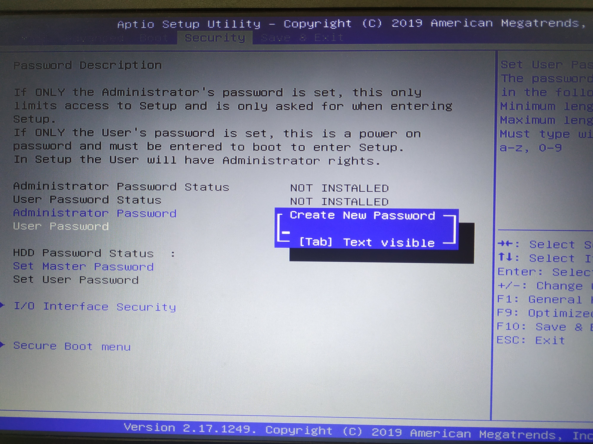
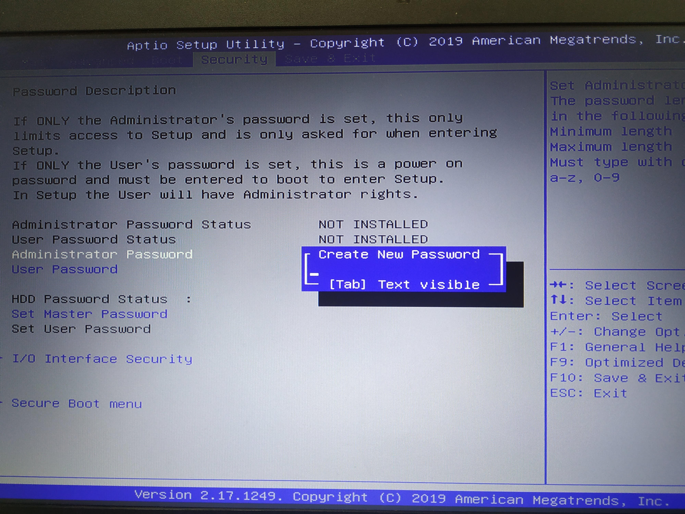
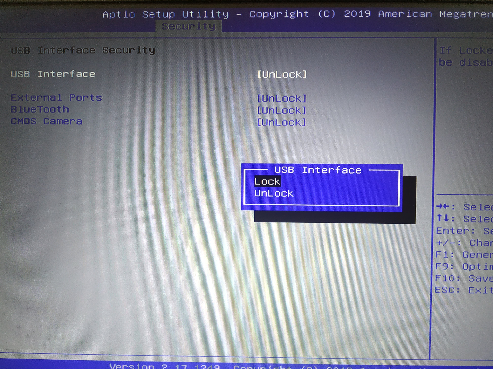
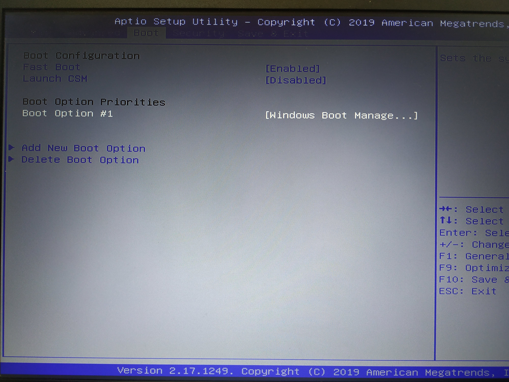
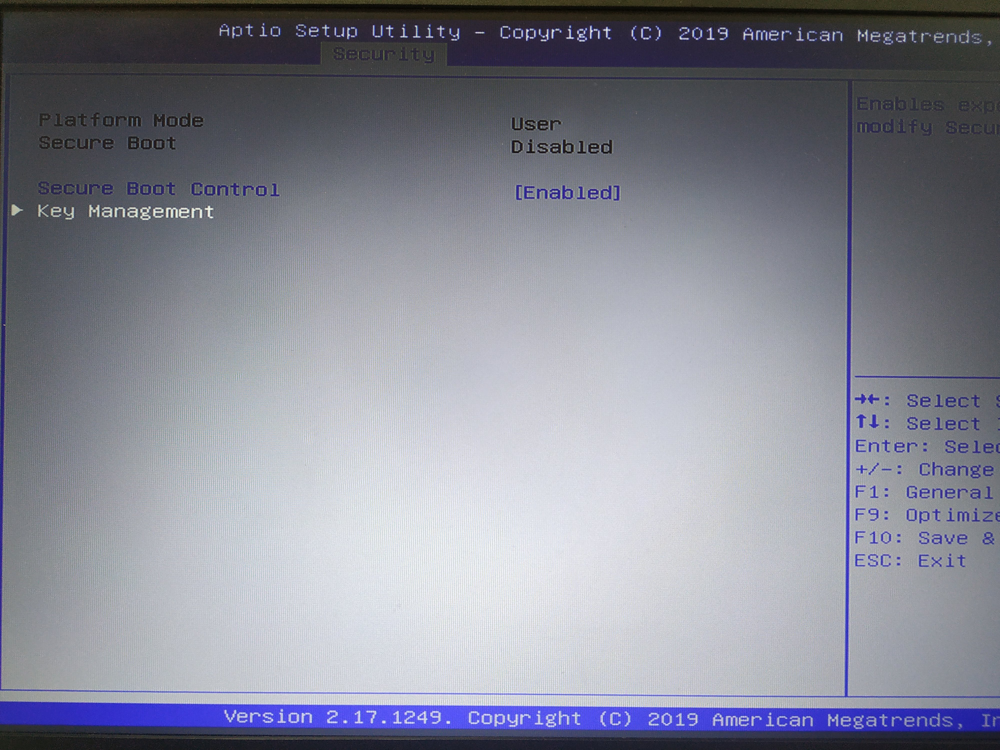
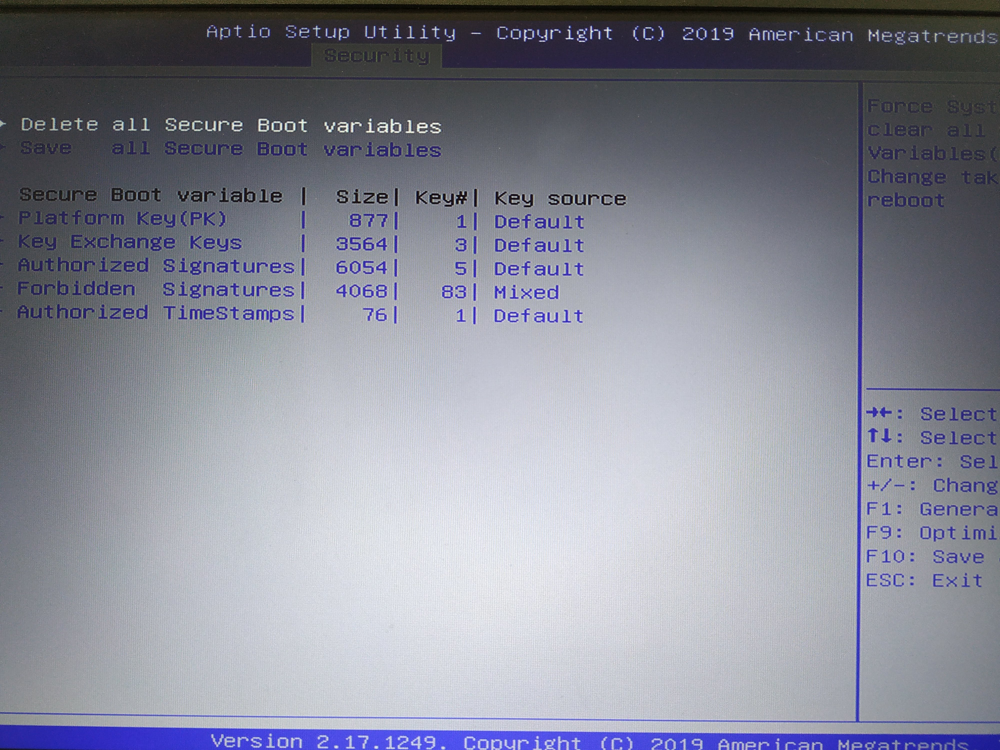
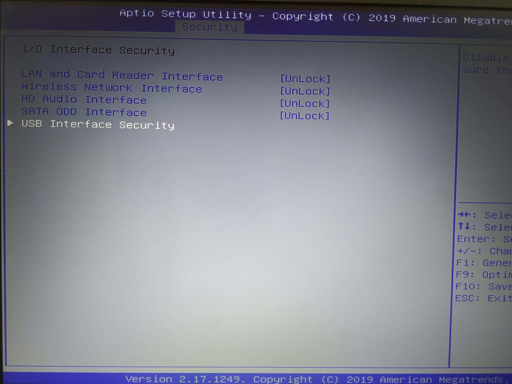

author: Jose Manuel Arrieta
summary: Hardening BIOS Asus GL752VW
id: asus
categories: codelab,markdown,hardening,bios
environments: Web
status: Published

# Bastionado del arranque del sistema de Asus GL752VW
## Inicio
Para acceder a la BIOS tendremos presionar el botón F2 a la hora de iniciar el sistema.
## Contraseña de usuario o Power-On
Si queremos que al iniciar el sistema este nos pida una contraseña para acceder, tendremos que ir a la pestaña **Security** de la BIOS y en la opción **User Password** nos pedirá escribir una contraseña.

## Contraseña de administrador
Si queremos que al acceder a la BIOS nos pida una contraseña, tendremos que acceder a la pestaña **Security** y en la opción **Administrator Password** nos pedirá escribir una contraseña.

## Arranques externos
Para deshabilitar el arranque externo, en la pestaña **Security** accedemos a **I/O Interface Security** y luego a **USB Interface Security**, en dicha pestaña podemos bloquear los usb para que no puedan arrancar desde ellos.

## Orden de arranque
Para cambiar el orden de arranque tan solo tendremos que entrar en la pestaña **Boot** y en el apartado **Boot Option Priorities** podemos elegir que dispositivo arranca primero

## Otras opciones de seguridad
Dentro de **Security** tenemos la opción **Secure Boot menu** desde la cual podemos acceder a la variables del **Secure Boot** y podemos editarlas

También dentro de **Security** y **I/O Interface Security** podemos bloquear la interfaz de red y disco óptico entre otros.
