author: Jose Manuel Arrieta
summary: Seguridad en routers domesticos
id: SRD
categories: codelab,markdown,hardening,networks
environments: Web
status: Published
# Seguridad en routers domesticos
## Inicio
Esta guía sera de como securizar el router domestico de tp-link Archer C80.
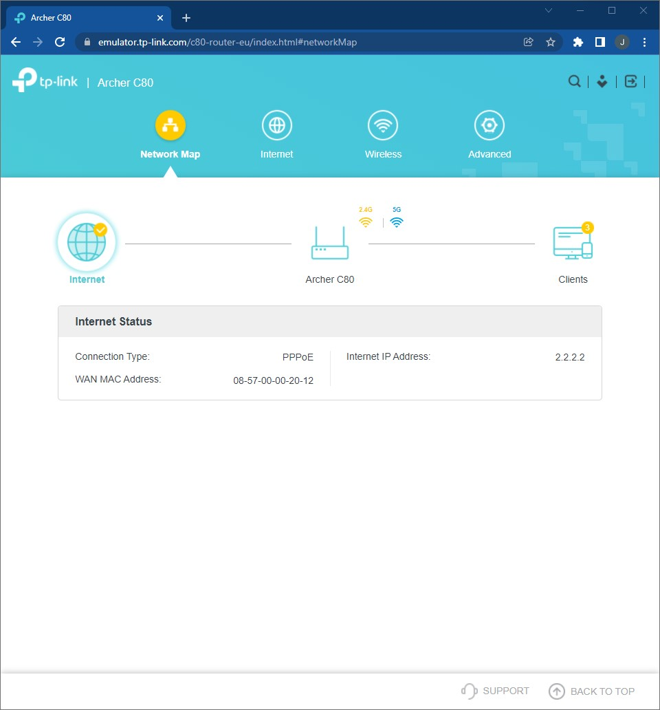 
## WPS
El wps no es recomendado tenerlo activado, para ello nos iremos a **Advanced->Wireless->WPS** y deshabilitar el wps
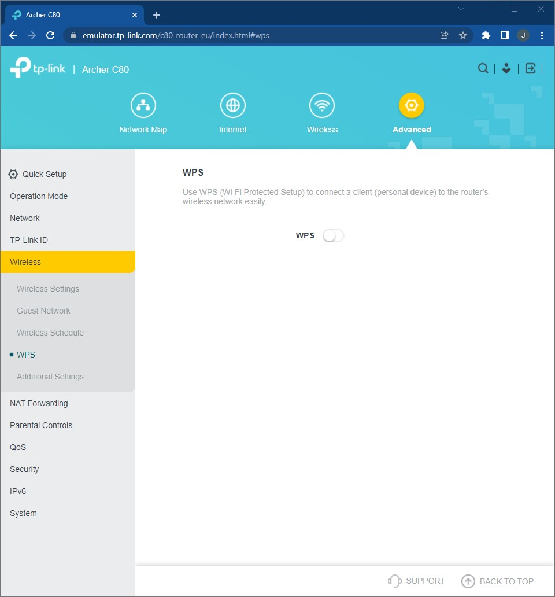
## Contraseñas por defecto
Es muy importante cambiar las contraseñas por defecto, tanto para la administración como la del wifi.
## Administración local
Para la administrción local debemos ir a **Advanced->System->Administration** En dicho apartado podemos cambiar la contraseña de administración por defecto y para la administración seleccionar unos dispositivos que puedan administrar.
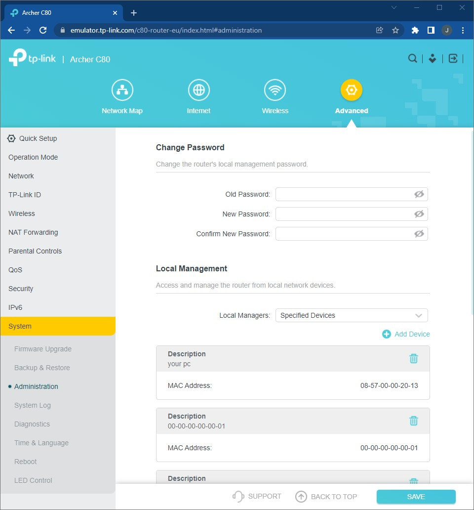
## Administración remota
En caso de no poder acceder normalmente al router deberemos de activar la administración remota **Advanced->System->Administration** y configurar el puerto y los equipos específicos que pueden entrar a traves de la ip.
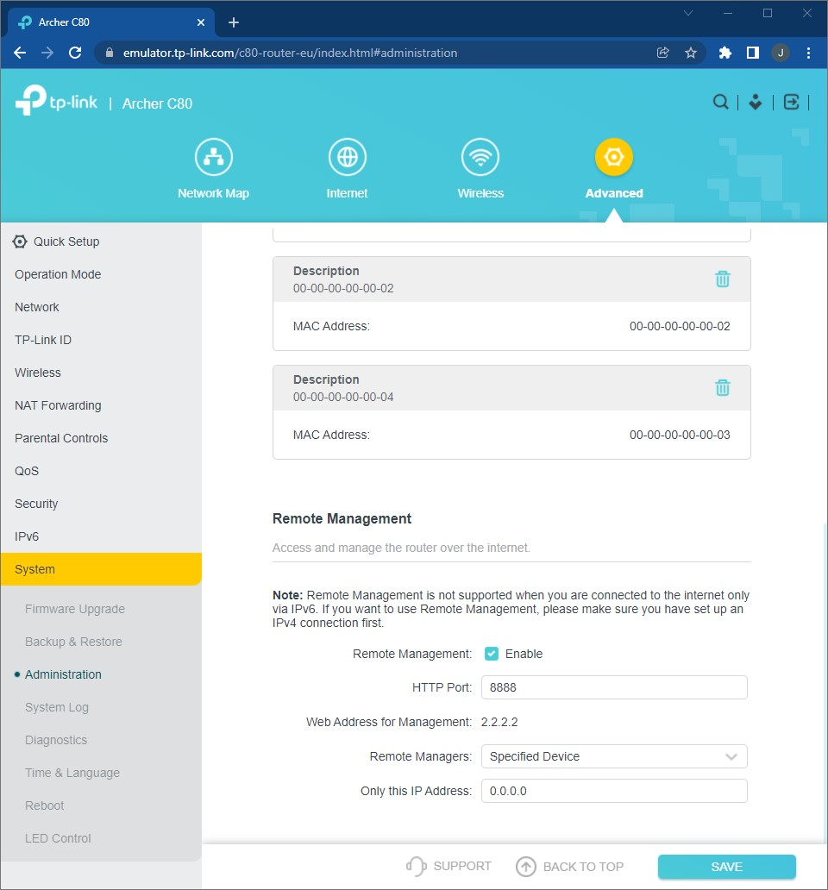
## FIREWALL
En cuanto al firewall ubicado en **Advanced->Security->Firewall** podemos activar el cortafuegos SPI y deshabilitar la opción de responder al ping tanto en WAN como en LAN.
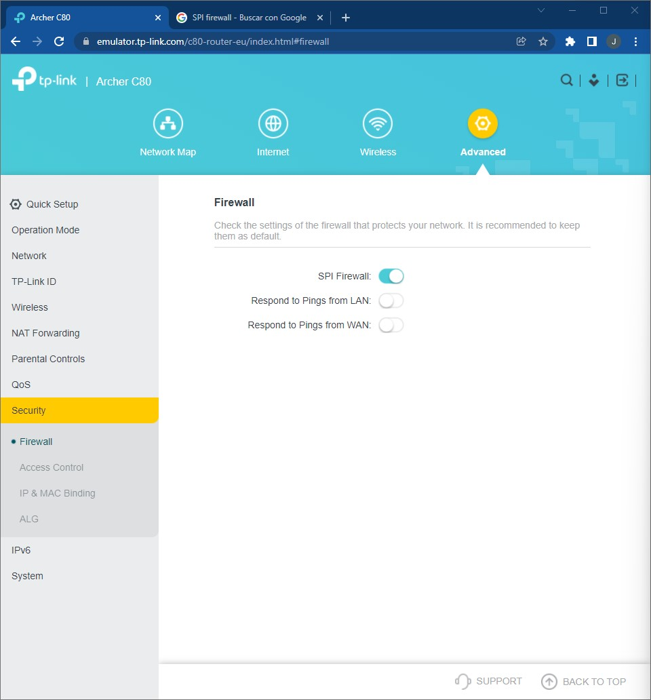
## WIFI
En caso del wifi lo primero que debemos hacer es cambiar las contraseñas por defecto.
**Advanced->Wireless->Guest Network**
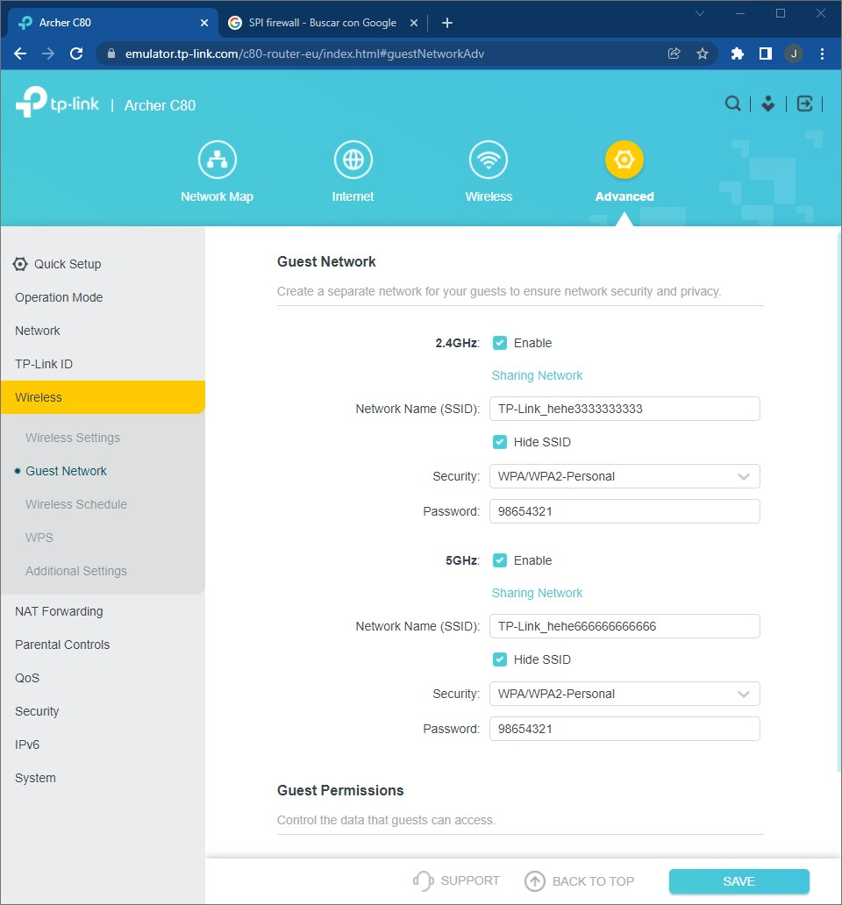

## REDES WIFI OCULTAS
Una medida de protección es ocultar el SSID a los demás dispositivos.
Para ellos accederemos a **Advanced->Wireless->Guest Network** y en la bandas que tengamos activadas activaremos el **Hide SSID**

## WPA2
Para mayor portección las contraseñas de wifi tiene que ser de tipo WPA2 asi que iremos a **Advanced->Wireless->Guest Network** y en la bandas activadas cambiaremos el **Security** a **WPA/WPA2-Personal**

## UPnP
En caso de estar jugando a juegos multijugador y en tiempo real deberemos de activar el UPnP, para ellos iremos a **Advanced->Nat Forwarding->UPnP** y lo activaremos.
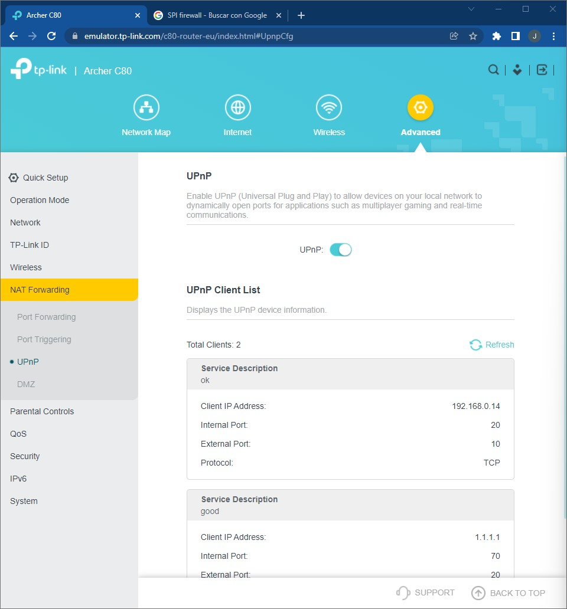
## Reenvío de puertos
Una de las prácticas más habituales que cambiar el puerto por defecto de algunos servicios que estemos utilizando, o simplemente conectar el servicio al equipo indicado, para ellos accederemos a **Advanced->Nat Forwarding->Port Forwarding** en dicho apartamos daremos clic en **add** y se abrirá un ventana para crear un reenvio de puertos, una vez configurado le daremos a **save**
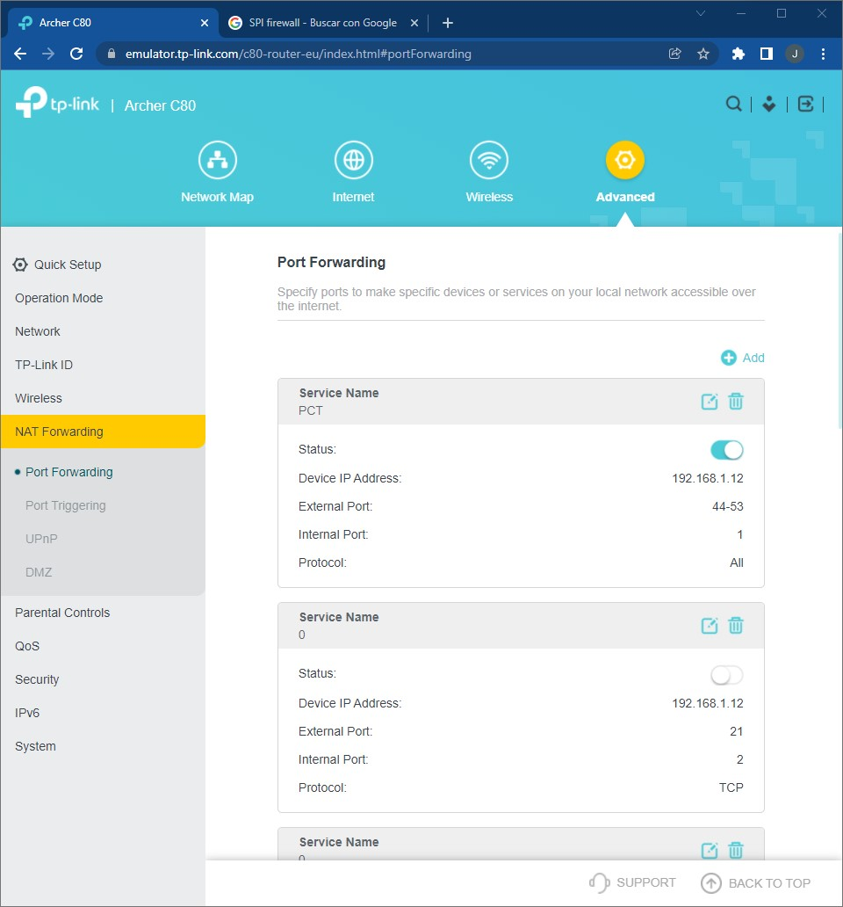
## IPv6
En caso de no utilizar IPv6 deberemos de desactivarlo para ello iremos a **Advanced->IPv6** y en **Mode* lo pondremos a **Disable**
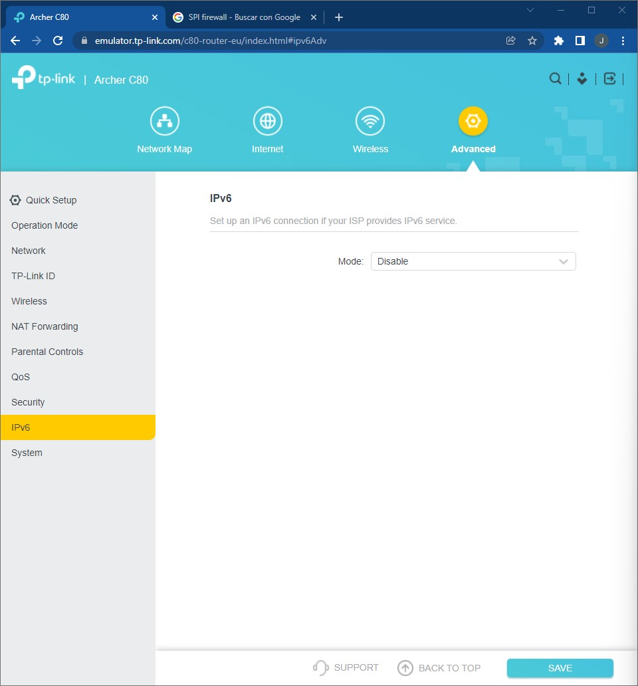
## ÓPCIONES de BACKUP
Una buena medida es hacer backup del router por si pudiera suceder algo y no sabemos que ha sido, poder mantener la configuación hecha.
En el apartado **Advanced->System->Backup & Restore** podemos hacer un backup tan solo clicando en **BACK UP** y podremos recuperar la configuración en restore, eligiendo el archivo y dando a **RESTORE**
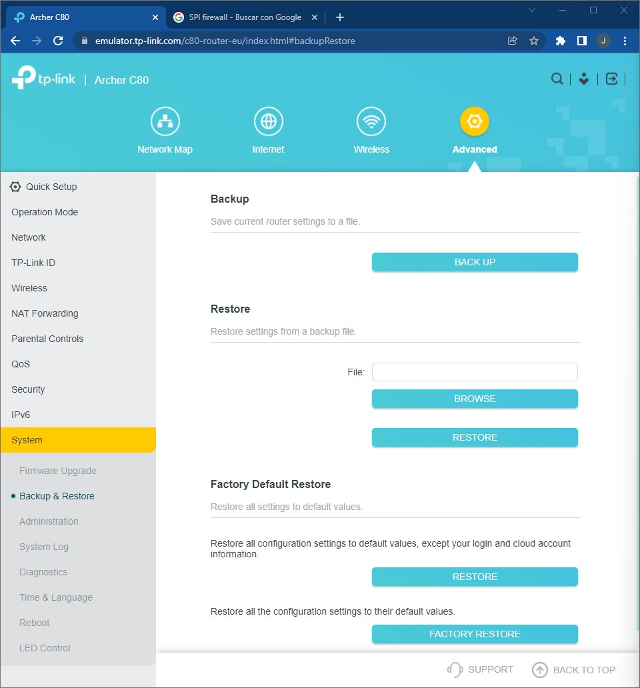
## FIRMWARE
Otra medida aconsejable es tener actualizar el firmware del router para ello nos iremos a **Advanced->System->Firmware Upgrade**, en este apartado podremos chequear las actualizaciones y actulizar teniendo el arhivo del nuevo firmware.
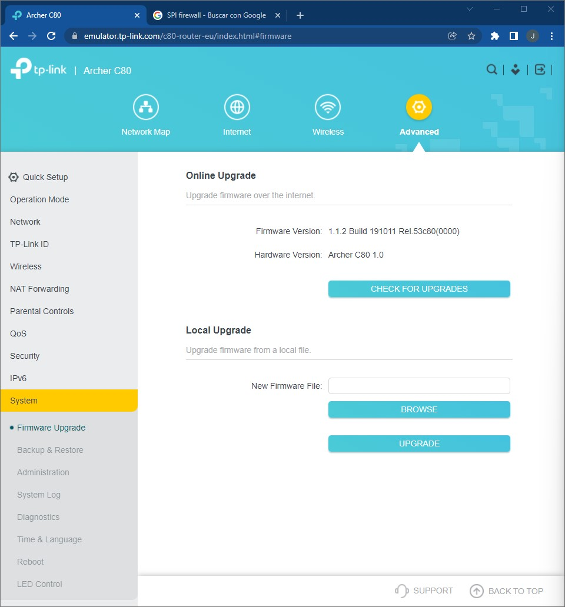